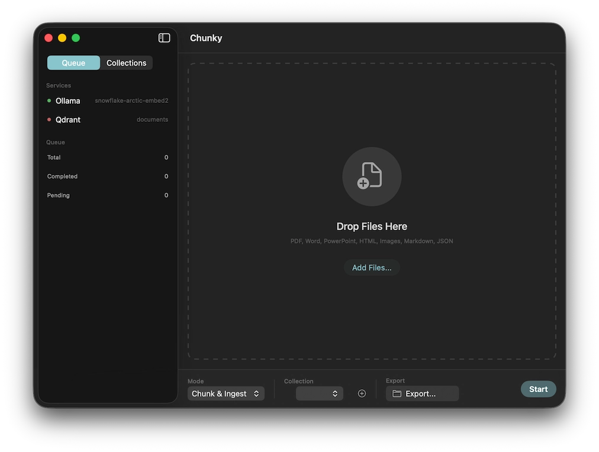

# Chunky

> **Early Development**: This app is in early development and has only been tested with specific configurations. Use at your own risk. Contributions and bug reports welcome!

A macOS app for chunking documents (PDF, DOCX, PPTX, HTML, images) into semantic chunks, generating embeddings via Ollama, and storing them in Qdrant for vector search.



## Requirements

- macOS 14.0+
- Swift 5.9+
- Python 3.10+
- [Ollama](https://ollama.ai/) (for embeddings)
- [Qdrant](https://qdrant.tech/) (cloud or local)
- Rust (for building qdrant-up CLI tool)

## Installation

### 1. Clone the repository

```bash
git clone https://github.com/hansdoebel/chunky.git
cd chunky
```

### 2. Set up Python environment

```bash
python3 -m venv .venv
source .venv/bin/activate
pip install -r requirements.txt
```

### 3. Build the qdrant-up CLI tool

```bash
cd qdrant-up
cargo build --release
cp target/release/qdrant-up ~/.local/bin/  # or /usr/local/bin/
cd ..
```

### 4. Build the app

```bash
./build-app.sh
```

### 5. Run the app

```bash
open build/Chunky.app
```

Or install to Applications:

```bash
cp -r build/Chunky.app /Applications/
```

Run with logs:

```bash
./build/Chunky.app/Contents/MacOS/Chunky
```

## Configuration

Before using Chunky, configure:

1. **Ollama**: Start Ollama and pull an embedding model:
   ```bash
   ollama serve
   ollama pull snowflake-arctic-embed2
   ```

2. **Qdrant**: Set up your Qdrant URL and API key in Preferences

### Tested Configuration

This app has been tested with:
- **Embedding model**: `snowflake-arctic-embed2` via Ollama
- **Accelerator**: CPU (MPS/Metal has known issues with some documents)
- **Qdrant**: Qdrant Cloud

Other configurations may work but have not been verified.

## Usage

1. Drag and drop documents into the app
2. Select a processing mode:
   - **Chunk Only**: Extract chunks and save as JSON
   - **Chunk & Ingest**: Full pipeline to Qdrant
   - **Ingest Only**: Upload pre-chunked JSON
   - **Batch Ingest**: Process multiple files efficiently
3. Click Start

## Supported Formats

- PDF, DOCX, PPTX, XLSX
- HTML, Markdown
- Images (PNG, JPEG, TIFF, WebP)
- CSV
- Pre-chunked JSON

## Architecture

```
Document -> Docling (chunking) -> Ollama (embeddings) -> Qdrant (storage)
```

- **Chunky/** - Swift macOS app
- **scripts/** - Python chunker using Docling
- **qdrant-up/** - Rust CLI for fast Qdrant uploads

## Development

### Watch Mode

For automatic rebuilding during development:

```bash
brew install fswatch  # if not installed
./watch-and-build.sh
```

This watches for Swift file changes and automatically rebuilds and restarts the app.

### Testing

End-to-end tests verify the full pipeline: chunking, embedding, and Qdrant upload.

#### Setup

1. Copy the example environment file:
   ```bash
   cp Chunky/Tests/.env.example Chunky/Tests/.env
   ```

2. Edit `Chunky/Tests/.env` with your credentials:
   ```
   OLLAMA_URL=http://localhost:11434
   EMBEDDING_MODEL=snowflake-arctic-embed2
   QDRANT_URL=https://your-cluster.cloud.qdrant.io
   QDRANT_API_KEY=your-api-key
   ```

3. Place a test PDF in `Chunky/Tests/Fixtures/sample.pdf`

#### Running Tests

```bash
cd Chunky/Tests

# Run all e2e tests
swift test --filter E2ETests

# Run specific test
swift test --filter testOllamaConnection
swift test --filter testChunkingWithPython
swift test --filter testFullPipeline
```

Tests will skip Qdrant-dependent tests if credentials are not configured.

## Security

### API Key Storage

Chunky stores the Qdrant API key in the macOS Keychain, not in plain text or UserDefaults. The key is:

- Stored with `kSecAttrAccessibleWhenUnlocked` - only accessible when your Mac is unlocked
- Scoped to the Chunky app only (`com.chunky.app` service identifier)
- Protected from copy/cut operations in the UI

### Keychain Permissions

During development, macOS may repeatedly prompt for Keychain access. This happens because ad-hoc signed builds get a new code signature each time, and macOS treats each build as a different app.

To avoid repeated prompts, create a self-signed certificate:

1. Open **Keychain Access**
2. Menu: **Keychain Access > Certificate Assistant > Create a Certificate...**
3. Configure:
   - Name: `Chunky Dev`
   - Identity Type: `Self Signed Root`
   - Certificate Type: `Code Signing`
4. Click **Create**

Then sign builds consistently:

```bash
codesign --force --sign "Chunky Dev" .build/debug/Chunky
```

## Documentation

- [Docling](https://ds4sd.github.io/docling/)
- [Ollama](https://ollama.ai/)
- [Qdrant](https://qdrant.tech/documentation/)
